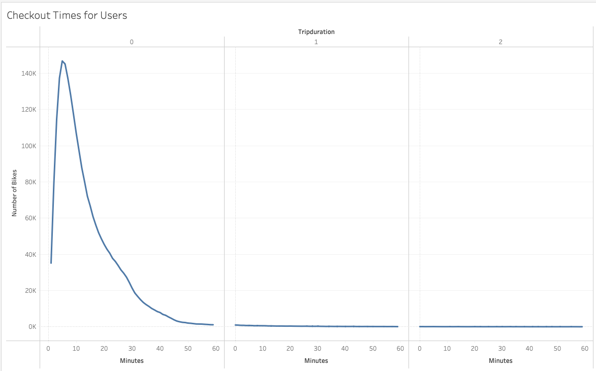
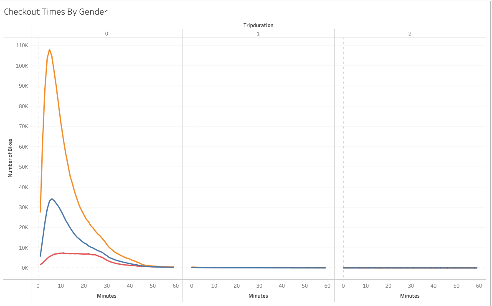
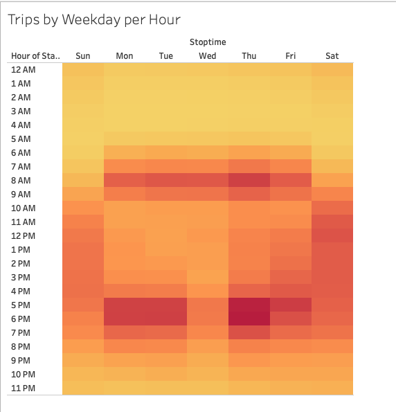
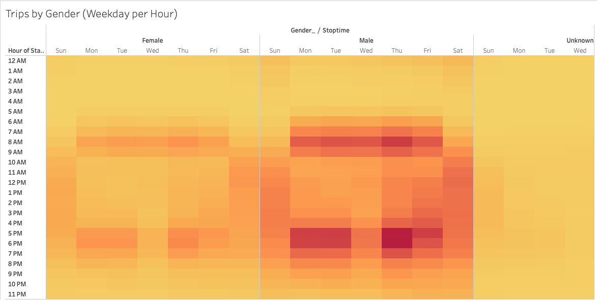
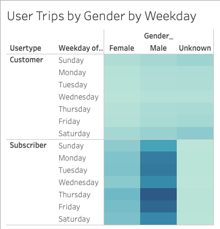
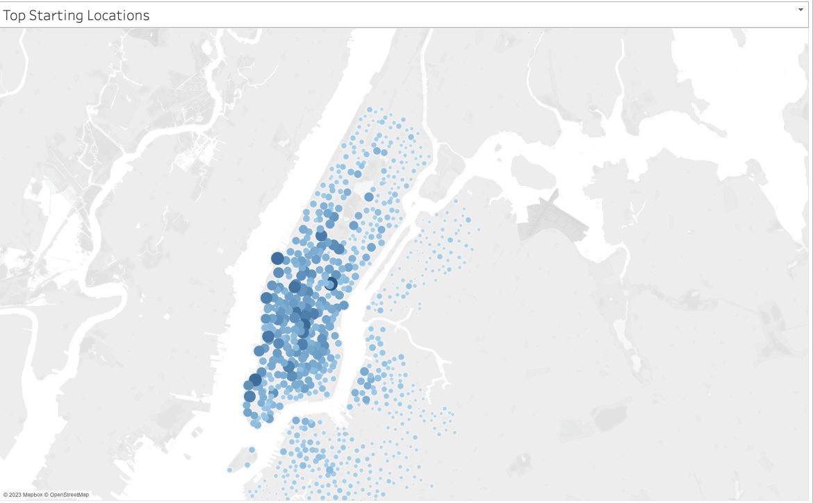
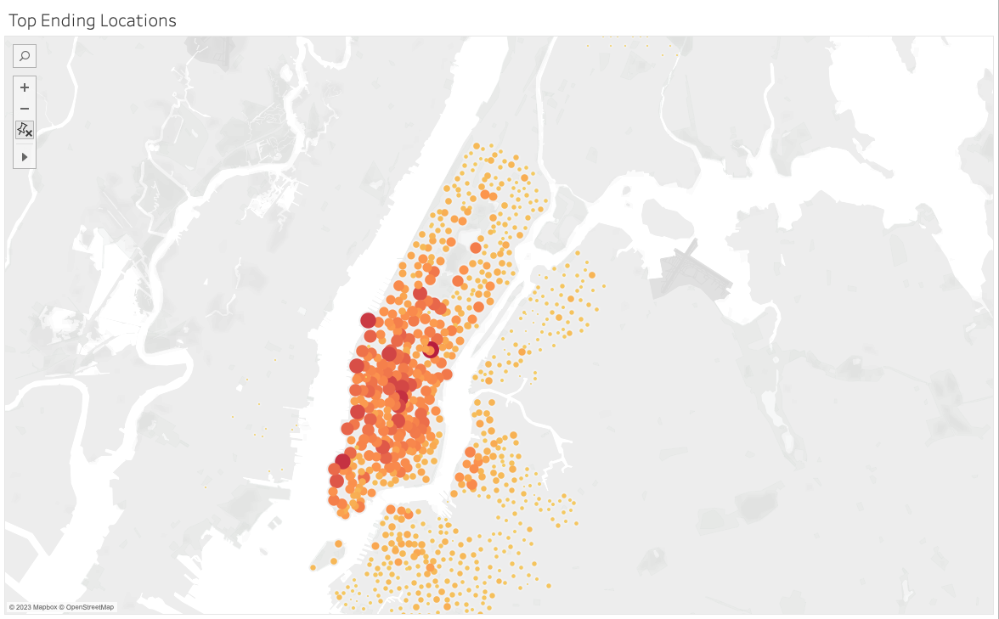

# bikesharing
Using Tableau to create visualizations on NYC citibike data from August 2019.

## Overview
Please click the link [here](https://public.tableau.com/app/profile/charlie.brooks/viz/NYC_Citibike_Analysis_16788385805990/NYCCitiBikeAnalysis) to view the Tableau story. 

The purpose of this project was to create visualizations using Tableau from CitiBike data in NYC to help investors begin a bikeshare program in Des Moins, Iowa. Some key questions that were used in this analysis were:
- Where are the most popular starting/ending locations?
- What time of day are bikes used the most/least?
- Who uses the bikes the most and how long are the bikes being used for by whom?

## Results

The following images below are the visualizations created for this analysis:
**

This line graph shows how many bikes are active once they are activated. From the image, the peak # of bikes are activated 10 mins into the ride. After about an hour, there are very few bikes that are active. 
**

This visualization is very similar to the first one displayed except gender is added as a variable. Amongst all bike riders, males are the most active users. Conclusions from the first visualization still hold true here. 
**

The following image is a heat map where the darker squares represent higher bike activity. Monday through Friday, the most popular times are 7-9am and 5-6pm. This could be an indication that people are using bikesharing as a form of commute. Other popular times are Saturday and Sunday afternoons which could indicate that people are wanting to use bikesharing in their freetime given that most people have that time free. 
**

Similar to the previous image, the heat map confirms the previous finding across genders. 
**

This image not only categorizes bikesharing users by gender but also by usertype (subscriber vs. customer). Like the previous two visualizations, this is also a heat map. Subscribers are more active than customers with Thursday and Friday being the most popular days of the week. In addition, more males are subscribers than females but the difference between customers by gender is negligible. 
**

The purpose of these last two images is to show popular locations where bikesharing is activated. The larger darker dots on the map represent more bikesharing activity. The most popular starting location in this case is lower manhattan and less activity in surrounding buroughs such as Brooklyn and the Bronx.
**

If we look at popular ending locations, the results are virtually the same meaning that people are not travelling far distances when using the bikes. This could be potentially benefitial if bikesharing is applied in smaller settings. 

## Summary

Given the results, bikesharing has a potential to be popular in other areas such as Des Moins, Iowa if the area has a majority male population and a practical use (i.e. commuting to work). More use cases are needed to see if it would work in other metropolitan areas like New York before applying bikesharing in smaller communities. Two visualizations I would add/modify are:
- Adding start/stop station names to the popular locations map. This could give us some more insight on why people are using bikesharing other than just commuting to work or having fun on the weekends. For example, Central Park or other nature areas could be popular/conducive to bikesharing
- The second I would add is a visualization on what age groups are using the bikesharing. For instance, if a lot of young people are using bikesharing but there aren't a lot of young people in Des Moins, Iowa, then it might not be the best fit. 
